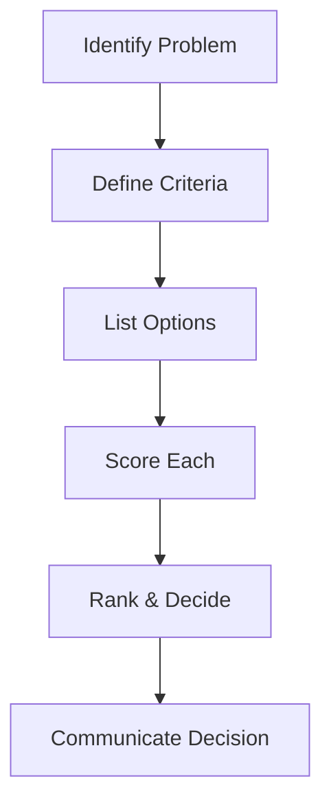

## Overview

The Loz Turner dashboard provides a centralized hub for planning daily tasks, visualizing key data, supporting decision-making, and facilitating communication. You access real-time insights into your projects, team performance, and external collaborations. Customize views to match your workflow, whether managing ADHD-focused task prioritization or ERP-style resource planning.

<Columns cols={3}>
  <Card title="Task Planner" icon="calendar" href="/docs/task-planner">
    Organize your day with drag-and-drop scheduling.
  </Card>
  <Card title="Data Viz" icon="bar-chart-3" href="/docs/data-viz">
    Interactive charts for quick insights.
  </Card>
  <Card title="Decision Tools" icon="brain" href="/docs/decision-tools">
    Workflows to evaluate options confidently.
  </Card>
</Columns>

## Navigating the Dashboard Interface

Start by logging in to see your personalized dashboard. The left sidebar contains navigation links to `Tasks`, `Analytics`, `Communications`, and `Settings`. The main panel displays widgets you can resize or rearrange.

- **Top Bar**: Search across all data, filter by date or priority.
- **Widgets**: Drag to reorder; click the `+` icon to add new ones like task lists or charts.
- **Right Panel**: Quick actions for sharing updates or exporting reports.

<Callout kind="tip">
  Pin frequently used widgets to the top for `<1s` access during busy days.
</Callout>

## Planning and Managing Daily Tasks

Use the task planner to break down your day into actionable items. Prioritize based on urgency and energy levels, ideal for executive function support.

<Steps>
  <Step title="Create Tasks" icon="plus">
    Click `New Task` and enter details like "Review Q3 sales report" with due time and priority.
  </Step>
  <Step title="Prioritize" icon="list">
    Drag tasks into time blocks: Morning High-Energy, Afternoon Routine, Evening Review.
  </Step>
  <Step title="Track Progress" icon="check-circle">
    Mark complete or snooze; view completion streaks for motivation.
  </Step>
  <Step title="Share Updates" icon="share">
    Assign to peers or generate shareable links for external companies.
  </Step>
</Steps>

## Data Visualization Techniques

Visualize metrics like task completion rates or project KPIs with built-in charts. Switch between views for deeper analysis.

<Tabs>
  <Tab title="Bar Charts" icon="bar-chart">
    Compare categories, such as tasks by status.

    ```javascript
    // Example data load for bar chart
    const taskData = [
      { status: "Completed", count: 45 },
      { status: "In Progress", count: 12 },
      { status: "Pending", count: 8 }
    ];
    ```

    Customize colors to match your brand (`#3B82F6` for Loz Turner).
  </Tab>
  <Tab title="Line Graphs" icon="trending-up">
    Track trends over time, like daily productivity.

    ```javascript
    // Sample trend data
    const productivityData = [
      { date: "2024-01-15", score: 85 },
      { date: "2024-01-16", score: 92 },
      { date: "2024-01-17", score: 78 }
    ];
    ```

    Hover for exact values and export as PNG.
  </Tab>
  <Tab title="Pie Charts" icon="pie-chart">
    Show proportions, e.g., time spent on categories.

    <Callout kind="info">
      Filter data by team or project for focused views.
    </Callout>
  </Tab>
</Tabs>

## Decision-Making Tools and Workflows

Leverage decision matrices and workflow automations to evaluate options systematically.

<Expandable title="Advanced Decision Workflow" default-open="false">

1. Input options like "Delegate to team" vs. "Handle personally".
2. Assign weights to criteria: Impact (40%), Time (30%), Risk (30%).
3. Auto-score and rank; visualize in a table.

| Option              | Impact | Time | Risk | Total Score |
|---------------------|--------|------|------|-------------|
| Delegate to team    | 9      | 8    | 6    | 7.8         |
| Handle personally   | 7      | 4    | 9    | 6.7         |
| Outsource           | 8      | 7    | 5    | 7.1         |

</Expandable>



Integrate with communication tools to notify peers instantly. Review past decisions in the audit log for continuous improvement. This structured approach enhances clarity and reduces decision fatigue.